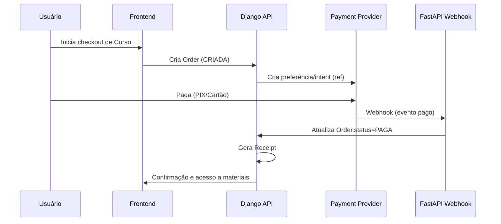

# Arquitetura (Mermaid)

```mermaid
flowchart LR
  subgraph Client[Frontend Next.js]
    UI[UI/Pages]
    SDK[TypeScript SDK]
    UI --> SDK
  end

  subgraph Django[Backend Django/DRF]
    Auth[Auth (allauth + JWT)]
    Domain[Domínio: Users, Courses, Enrollments, Scheduling, Payments, Support]
    Admin[Admin]
    API[DRF API]
    Celery[Celery Worker]
    Auth --> API
    Domain --> API
    Domain --> Admin
    API --> Celery
  end

  subgraph FastAPI[Serviços FastAPI]
    Webhooks[Payments Webhooks]
    Reports[Reports]
    Notify[Notifications]
    Health[/healthz & /metrics]
  end

  DB[(PostgreSQL)]
  Cache[(Redis)]
  Storage[(MinIO S3)]

  Django --- DB
  Django --- Cache
  Django --- Storage

  FastAPI --- DB
  FastAPI --- Cache

  SDK --> API
  FastAPI --> Django
  Webhooks --> API
  Notify --> Celery
```

## Sequência de Pagamento

